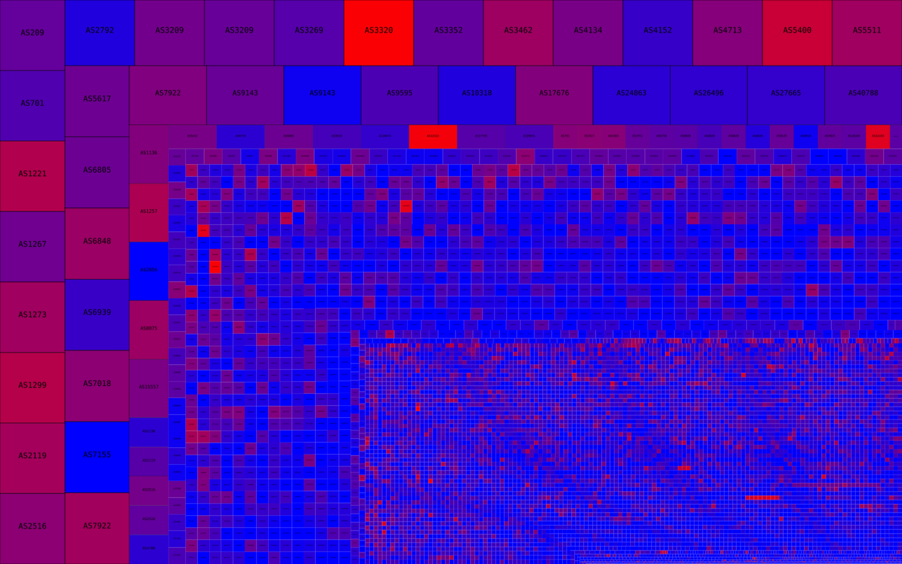

# THIS REPOSITORY HAS MOVED

The zesplot repository is moved to https://github.com/zesplot/zesplot , please go there.

This repository will no longer see updates.

<pre>


</pre>

old stuff:

# What is zesplot?

Zesplot is an attempt at visualising IPv6 addresses and their prefixes. It is
based on squarified treemaps, producing space-filling plots with relative
sizing and colours. 


## Compiling

Zesplot is implemented in Rust so we can leverage `cargo` to build it. Consider
using rustup ( https://rustup.rs/ ) if you are new to Rust. We need to use
nightly in order to leverage the 128 bit integer features not yet in the stable
channel. Using rustup, run `rustup override set nightly` from within the cloned
repository. Check using `rustc -V` whether you are now indeed using nightly.

Once you have Rust up and running, and cloned this repository, use either

	cargo build

or

	cargo build --release

to compile zesplot. The resulting binaries will be respectively
`target/debug/zesplot` and `target/release/zesplot`.

## Using zesplot

The (possibly outdated) `ipv6_prefixes.txt` containing announced v6 prefixes
(created from RouteViews data) can be passed using `--prefixes`. The
`address-file` passed must be a list of addresses, one-per-line.

The prefix and address lists are mandatory arguments. Other options are listed
below.

After running, the resulting SVG file is written to `html/image.svg`, and it is
inlined in `html/index.html`.


## Example output





```
$ zesplot -h

USAGE:
    zesplot [FLAGS] [OPTIONS] --addresses <address-file> --prefixes <prefix-file>

FLAGS:
    -d, --draw-hits    Plot addresses on their respective areas
    -f, --filter       Filter out empty prefixes, only plotting prefixes containing addresses from the --addressess
    -h, --help         Prints help information
    -V, --version      Prints version information

OPTIONS:
    -a, --addresses <address-file>    IPv6 addresses to plot on map
    -l, --limit <plot-limit>          Limits number of areas plotted. 0 for unlimited. Default 2000
    -p, --prefixes <prefix-file>      Prefixes to map
```
